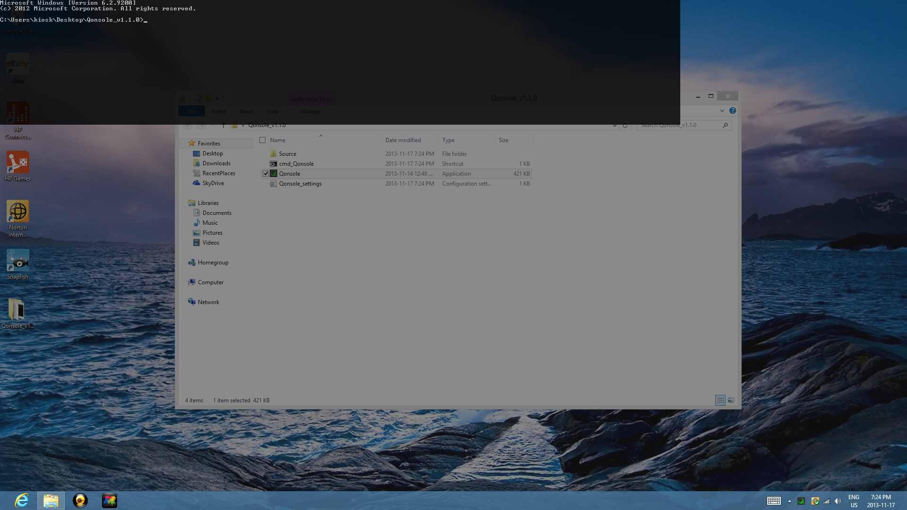
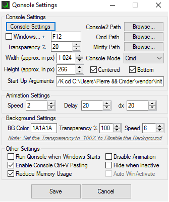

#  Qonsole
  
A Quake-like Console Emulator written in AutoHotkey. Configurable with [Cmd](https://en.wikipedia.org/wiki/Cmd.exe), [Console2](https://sourceforge.net/projects/console/) and [mintty](https://mintty.github.io/).  
Sourceforge project page: https://sourceforge.net/p/qonsole-ahk  
Released under the [MIT License](LICENSE.md).  

  

###Features
- Custom hotkey
- Slide up & down animation
- Enable Ctrl+v Console pasting
- Transparency options
- Configurable with cmd & console2
- Background screen dimmer
- Internal Update check, (automatic, 5 min after start up)
- Optionally Run Qonsole when Windows Starts
- More..

###Screenshots
_Default view_  
> 
  
_Settings panel_  
> 

###User Reviews
*_triarif_*  
★★★★★ (5/5)  
> so far so good, i just want the icon clicked once not double-clicked to bring the console  
_Posted 05/07/2015_
  
*_winiciuscota_*  
★★★★★ (5/5)  
> thank you very much!  
_Posted 02/04/2015_
